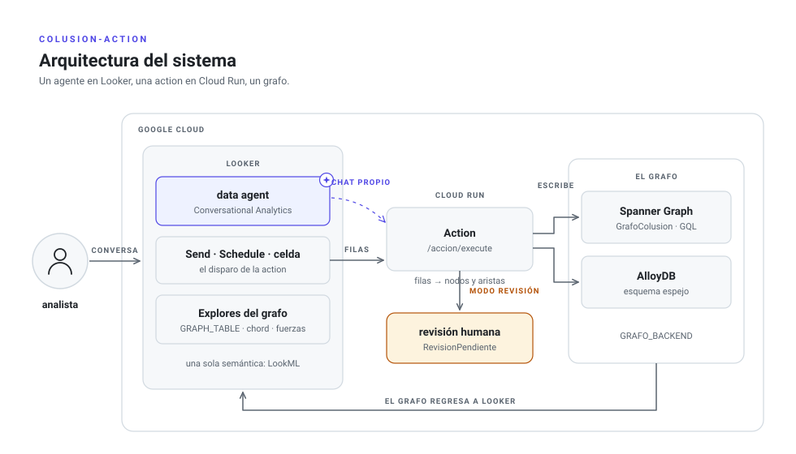
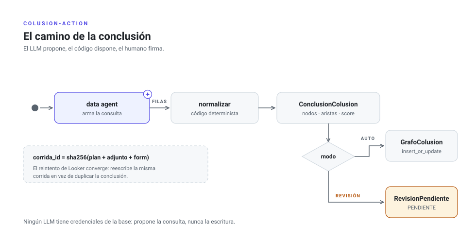
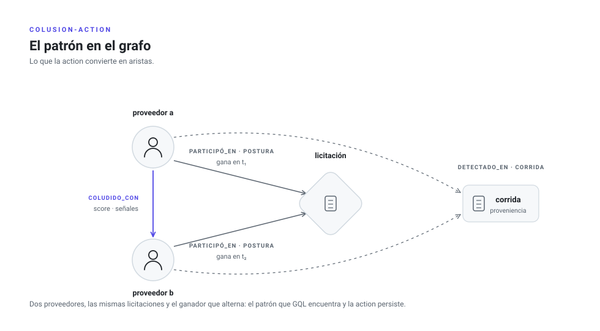

# colusion-action: un agente en Looker + una action + un grafo

## Despliegue en un clic

Sube este directorio a un repo **público** de GitHub y reemplaza
`TU_USUARIO/colusion-action` en estos badges:

```markdown
[](https://deploy.cloud.run/?git_repo=https://github.com/TU_USUARIO/colusion-action.git)
[](https://shell.cloud.google.com/cloudshell/editor?cloudshell_git_repo=https://github.com/TU_USUARIO/colusion-action.git&cloudshell_tutorial=tutorial.md)
```

**Botón "Run on Google Cloud"** (el clic de verdad): abre Cloud Shell,
pregunta proyecto/región, genera el token automáticamente
(`generator: secret` en `app.json`) y sus hooks corren las mismas fases de
`instalar/fases.sh`: `precreate` habilita APIs, crea la service account y la
instancia Spanner Enterprise con el grafo; el botón construye y crea el
servicio; `postcreate` le pone la service account mínima, espeja el token en
Secret Manager, fija `URL_BASE`, espera `/listo` y te imprime el bloque
exacto para pegar en Looker. Backend del clic: Spanner (AlloyDB sigue por
`desplegar.sh` porque exige decisiones de red).

**Botón "Open in Cloud Shell"**: repo clonado + `tutorial.md` guiado en 4
pasos (deploy → aceptación → registro en Looker → chat). Úsalo para repos
privados o cuando quieras ver cada fase.

**CLI**: `./instalar/desplegar.sh` (misma lógica; sirve para CI y AlloyDB).

Los tres caminos convergen: mismo servicio, mismas garantías, misma
aceptación (`probar.sh`). El único paso que ningún botón puede dar es pegar
URL+token en Admin de Looker (es *su* instancia); queda impreso al final.


Version minima del patron de [fleet-agent](https://github.com/hendrixtlan/fleet-agent):
en lugar de flotas de agentes ADK en Cloud Run Jobs, **un solo data agent de
Conversational Analytics dentro de Looker** hace el analisis, y una **action
custom** (Action API de Looker, servida desde Cloud Run) escribe las
conclusiones de colusion a un grafo: **Spanner Graph** por defecto, **AlloyDB**
como alternativa de costo. El principio se conserva: *el LLM propone, el codigo
dispone* — el agente solo arma consultas gobernadas por LookML; toda escritura
al grafo es codigo determinista e idempotente con proveniencia (nodo `Corrida`).

## Arquitectura

<picture>
  <source media="(prefers-color-scheme: dark)" srcset="docs/img/arquitectura-dark.svg">
  
</picture>

La convencion de las laminas: **neutro** para infraestructura y codigo
determinista, **indigo** para lo que hace un LLM, **ambar** para la
intervencion humana. GitHub sirve la variante clara u oscura segun tu tema.

## El camino de la conclusion

<picture>
  <source media="(prefers-color-scheme: dark)" srcset="docs/img/camino-dark.svg">
  
</picture>

La tarjeta indigo con la chispa es el unico paso probabilistico; lo demas es
codigo determinista. El principio: **el LLM propone, el codigo dispone**.
Ningun LLM tiene credenciales de la base.

## El patron en el grafo

Lo que la action caza — "dos proveedores participan en las mismas licitaciones
y el ganador alterna" — es literalmente una figura en `GrafoColusion`:

<picture>
  <source media="(prefers-color-scheme: dark)" srcset="docs/img/patron-dark.svg">
  
</picture>

La consulta GQL que encuentra esa figura esta en `sql/spanner_graph.sql`
(y su equivalente con `WITH RECURSIVE` en `sql/alloydb.sql`).

## Instalación end to end (runbook)

```bash
# 0. Prerrequisitos: gcloud autenticado, proyecto con billing,
#    credenciales API de Looker (client id/secret) y permisos de Owner/Editor.
gcloud auth login && gcloud auth application-default login

# 1. Infraestructura + action (APIs, base, secreto, Cloud Run)
export PROYECTO=mi-proyecto REGION=us-central1 BACKEND=spanner
./instalar/desplegar.sh          # imprime URL y token al final

# 2. Probar SIN Looker (si esto pasa, la tubería completa funciona)
./instalar/probar.sh             # list → execute → lee ColudidoCon del grafo

# 3. Registro en Looker (manual, una sola vez):
#    Admin → Platform → Actions → Add Action Hub → URL + token → Test.
#    Desde aquí ya funcionan Explore→Send, schedules y la action de celda.

# 4. (Para detonar desde el chat) crear el data agent de la CA API:
export LOOKER_BASE_URL=https://tuempresa.cloud.looker.com \
       EXPLORES="compras:licitaciones" DATA_AGENT_ID=colusion
python3 instalar/crear_agente.py # imprime el DATA_AGENT_ID completo

# 5. Correr el chat (local, o a Cloud Run con chat/Dockerfile)
cd chat && pip install -r requirements.txt
export GOOGLE_CLOUD_PROJECT=$PROYECTO LOOKER_CLIENT_ID=... LOOKER_CLIENT_SECRET=... \
       ACTION_URL=<URL del paso 1> ACTION_HUB_TOKEN=<token del paso 1>
streamlit run app.py             # variante agente-detona: adk web (raiz_adk.py)
```

Orden de dependencias: la base y la action no necesitan nada de Looker; el
paso 3 habilita los caminos nativos; los pasos 4–5 solo hacen falta para
detonar desde el chat. `desplegar.sh` es idempotente: reejecutarlo no
duplica recursos.


```
app/          servicio Action API (FastAPI) para Cloud Run
  main.py         endpoints: / (lista), /accion/form, /accion/execute, /accion/celda
  contratos.py    ConclusionColusion, Implicado, Arista (Pydantic)
  repositorio.py  puerto GrafoRepositorio + adaptadores Spanner y AlloyDB
sql/
docs/img/     laminas del README (claro/oscuro); se regeneran con
              `python3 docs/img/generar.py` — no editar los .svg a mano
instalar/     desplegar.sh (infra+deploy), probar.sh (e2e sin Looker), crear_agente.py
chat/         app.py (boton detona), agente/agent.py (agente detona), comun.py
  spanner_graph.sql   DDL + CREATE PROPERTY GRAPH + consultas GQL de ejemplo
  alloydb.sql         DDL espejo + consultas SQL recursivas equivalentes
```

## 1. Base de datos

### Opcion A — Spanner Graph (por defecto)

Spanner Graph requiere **edicion Enterprise** y dialecto **GoogleSQL**.
Con 100 processing units alcanza para arrancar:

```bash
gcloud spanner instances create colusion-graph \
  --config=regional-us-central1 --processing-units=100 \
  --edition=ENTERPRISE --description="Grafo de colusion"

gcloud spanner databases create colusion --instance=colusion-graph \
  --ddl-file=sql/spanner_graph.sql
```

> Nota si reutilizas el `spanner.tf` de fleet-agent: agrega
> `edition = "ENTERPRISE"` al `google_spanner_instance`, o el
> `CREATE PROPERTY GRAPH` fallara.

### Opcion B — AlloyDB (si el costo de Spanner asusta)

```bash
gcloud alloydb clusters create colusion --region=us-central1 \
  --password=<contrasena-postgres>
gcloud alloydb instances create colusion-primaria --cluster=colusion \
  --region=us-central1 --instance-type=PRIMARY --cpu-count=2
psql "$ALLOYDB_DSN" -f sql/alloydb.sql
```

AlloyDB gestionado no trae extension de grafos, asi que el grafo vive en
tablas de nodos/aristas y los recorridos usan `WITH RECURSIVE` (ver
`sql/alloydb.sql`). El esquema es espejo del de Spanner: migrar despues es
copiar tablas y agregar el `CREATE PROPERTY GRAPH`.

## 2. Desplegar la action en Cloud Run

```bash
# token compartido entre Looker y el servicio
openssl rand -hex 24 | gcloud secrets create action-hub-token --data-file=-

gcloud run deploy colusion-action --source app/ --region us-central1 \
  --allow-unauthenticated \
  --set-secrets ACTION_HUB_TOKEN=action-hub-token:latest \
  --set-env-vars GRAFO_BACKEND=spanner,GOOGLE_CLOUD_PROJECT=<proyecto>,SPANNER_INSTANCE=colusion-graph,SPANNER_DATABASE=colusion

# segunda pasada: fijar URL_BASE con la URL que Cloud Run asigno
gcloud run services update colusion-action --region us-central1 \
  --update-env-vars URL_BASE=https://colusion-action-XXXX.run.app
```

Para AlloyDB: `GRAFO_BACKEND=alloydb` y `ALLOYDB_DSN=host=... dbname=colusion
user=... password=... sslmode=require` (con IP privada + VPC connector, o el
AlloyDB Auth Proxy como sidecar). Da al service account del servicio
`roles/spanner.databaseUser` o `roles/alloydb.client` segun el backend.

`--allow-unauthenticated` es necesario porque Looker no firma peticiones IAM
de Google; la autenticacion real es el token del Action Hub, que `main.py`
valida en cada peticion. Opcional: restringir ingress con Cloud Armor a las
IPs de tu instancia de Looker.

## 3. Registrar en Looker

1. **Admin → Platform → Actions → "Add Action Hub"** (hasta abajo).
2. Action Hub URL: la URL raiz del servicio (`https://colusion-action-XXXX.run.app`).
3. En **Configure Authorization**, pega el mismo token del secreto.
4. Habilita la action "Escribir conclusión al grafo de colusión" y usa **Test**.

## 4. Como la usa el agente (tres caminos)

**a) Conversacional → Send.** El analista conversa con el data agent
(Conversational Analytics) sobre el Explore de licitaciones: *"¿qué pares de
proveedores comparten más del 80% de licitaciones y alternan ganador?"*. El
agente arma la consulta gobernada; el analista la abre en el Explore y con el
engrane **Send** elige la action. El form pregunta modo (directo / revisión
humana), score y notas → eso se persiste como `Corrida` + aristas.

**b) Schedules = flotas.** Guarda la consulta como Look y programala con la
action como destino. Cada schedule equivale a una "flota" de fleet-agent, sin
Cloud Scheduler ni Jobs: Looker ya trae el cron.

**c) Celda (LookML).** Para marcar una colusion puntual desde cualquier tabla:

```lookml
dimension: proveedor_id {
  sql: ${TABLE}.proveedor_id ;;
  action: {
    label: "Marcar colusión en el grafo"
    url: "https://colusion-action-XXXX.run.app/accion/celda"
    form_param: { name: "coludido_con" type: string label: "Coludido con (proveedor_id)" required: yes }
    form_param: { name: "notas" type: textarea label: "Notas del analista" }
  }
}
```

### Columnas que la action sabe mapear

Por sufijo del nombre de campo (configurable por env vars `CAMPO_*`):

| Forma | Campos minimos | Se escribe |
|---|---|---|
| pares | `proveedor_a`, `proveedor_b` (+`licitacion_id`, `score`) | `COLUDIDO_CON` (+`PARTICIPO_EN`) |
| bipartita | `proveedor`, `licitacion_id` | `PARTICIPO_EN`; los anillos se descubren luego con GQL/SQL |

El resto de columnas de cada fila viaja como `props` de la arista (la
evidencia queda pegada a la relacion).

### Instrucciones sugeridas para el data agent

En Looker → Conversations → Manage agents → New agent, sobre el Explore de
licitaciones, algo como:

> Eres un analista antimonopolio. Señales de colusión que debes buscar:
> proveedores que comparten alta proporción de licitaciones, alternancia de
> ganador (rotación de posturas), diferencias de postura constantes,
> retiros sistemáticos. Cuando propongas una lista de pares sospechosos,
> incluye siempre las columnas proveedor_a, proveedor_b, licitacion_id y una
> medida de score entre 0 y 1, porque ese es el formato que la action
> "Escribir conclusión al grafo de colusión" sabe convertir en aristas.

Agrega golden queries con esas consultas verificadas para anclar el patron.

## 5. Detonar la action desde el chat (carpeta `chat/`)

El chat nativo de Conversational Analytics **dentro** de Looker no puede
invocar actions custom del Action Hub (sus unicos disparos automaticos hoy
son los agentic workflows en preview, con destinos email/Slack/app movil).
Para detonar desde el chat se construye un chat propio del mismo agente;
ambas variantes pegan al mismo `/accion/execute` con el mismo token:

**a) `chat/app.py` — el humano detona (recomendado para arrancar).**
Front Streamlit que conversa con el data agent via la Conversational
Analytics API (fuente Looker: mismos Explores, instrucciones y golden
queries), conserva las ultimas filas que el agente devolvio y un boton
"Escribir conclusion al grafo" las manda a la action. Determinista: ningun
LLM decide escrituras.

```bash
cd chat && pip install -r requirements.txt
export GOOGLE_CLOUD_PROJECT=... CA_LOCATION=global DATA_AGENT_ID=colusion \
       LOOKER_CLIENT_ID=... LOOKER_CLIENT_SECRET=... \
       ACTION_URL=https://colusion-action-XXXX.run.app ACTION_HUB_TOKEN=...
streamlit run app.py
```

Nota: los agentes creados dentro de Looker no son visibles fuera de Looker;
para este camino el data agent se crea como recurso de la CA API con fuente
Looker (mismas instrucciones), o bien se usa el patron equivalente con los
endpoints `ConversationalAnalytics` del API de Looker si prefieres que el
agente siga gestionado en Looker.

**b) `chat/agente/agent.py` — el agente detona (patron "governed" de ADK).**
Agente raiz con `DataAgentToolset` (tool `ask_data_agent`) + la tool custom
`escribir_grafo_colusion`. El usuario puede decir *"y escribe esa conclusion
al grafo"* y el agente llama la tool. Guardrail: la tool escribe en modo
`revision` (RevisionPendiente) salvo peticion explicita de escritura
directa, y la conversion filas→aristas sigue siendo la de la action.
Probar local con `cd chat && adk web`.

Este chat puede embeberse de vuelta en Looker (extension framework / iframe)
para que los analistas no salgan de Looker.

## Ver el grafo dentro de Looker (carpeta `lookml/`)

El grafo regresa a Looker como Explores — el ciclo completo vive en un solo
lugar: el agente encuentra, la action escribe, Looker enseña lo escrito.

1. **Conexion**: Admin → Connections → dialecto **Google Spanner**
   (project / instance / database de `colusion-graph`), con una service
   account que tenga `roles/spanner.databaseUser`.
2. **Proyecto LookML**: importa `lookml/` (modelo `colusion`). El truco
   central: derived tables con **GQL adentro de SQL via `GRAPH_TABLE`** —
   el patron de grafo corre en Spanner, Looker agrupa y grafica encima.
   Explores: pares por licitaciones compartidas, anillo parametrizado por
   proveedor (camino cuantificado 1..3 saltos), conclusiones (aristas),
   cola de revision y proveniencia por corrida.
3. **Visualizacion**: instala del Marketplace (Marketplace →
   Visualizations) **Chord** — dos dimensiones + una medida: exactamente
   `(a, b, licitaciones_compartidas)` — y **Sankey** / **Collapsible
   Tree** para flujos proveedor→licitacion y el anillo. El dashboard
   `grafo_colusion` trae los tiles listos; cambia el tipo de viz en la UI
   tras instalar.
4. **Cierres de ciclo**: la vista `pares_por_licitacion.a` trae la action
   de celda ("Marcar colusion en el grafo" → `/accion/celda`); agrega estos
   Explores al data agent para que el agente lea sus propias conclusiones;
   y monta un agentic workflow sobre `revision_pendiente.pendientes` para
   avisar por Slack cuando haya conclusiones esperando firma humana.
5. **El as de la demo**: Spanner Studio visualiza el grafo nativo (nodos y
   aristas) cuando la consulta devuelve nodos con `SAFE_TO_JSON` — usalo
   para el momento "network graph" mientras Looker muestra chord y tablas.
   Y el network **dentro** de Looker ya viene incluido: ver la siguiente
   seccion.

### Force-directed dentro de Looker (custom viz incluido)

`app/estaticos/grafo_fuerza.js` es un custom viz (API de visualizaciones de
Looker) probado contra DOM real: grafo de fuerzas con D3, nodos por grado,
aristas ponderadas por la medida, zoom, arrastre, tooltips y **drill nativo
de Looker** al hacer clic en una arista. La misma action lo sirve en
`https://TU-SERVICIO.run.app/viz/grafo_fuerza.js` (ruta publica, sin
secretos).

Registro (una vez): **Admin → Platform → Visualizations → Add** con
ID `grafo_fuerza`, Main = la URL anterior y Dependencies =
`https://d3js.org/d3.v7.min.js`. Alternativa mas gobernada: parametro
`visualization:` en el manifest del proyecto LookML (con `file:` para
empaquetarlo dentro del repo LookML y que Looker lo sirva internamente,
versionado con los commits).

Uso: en cualquier Explore con 2 dimensiones (origen, destino) + 1 medida —
p.ej. `pares_por_licitacion (a, b, licitaciones_compartidas)` o el Explore
`anillo` — elige "Grafo de colusion (fuerzas)". Disciplina de rendimiento:
el viz corta con mensaje claro arriba de `max_nodos` (default 300); un
force layout dibuja subgrafos, no el grafo completo — el GQL limita antes
de que D3 dibuje.

**Fase 2 real (se cotiza): la consola de investigacion** con el extension
framework (`@looker/extension-sdk-react` + manifest `application:` con
entitlements `core_api_methods` y `external_api_urls`): expandir anillos al
clic (inline query sobre el Explore `anillo`), panel de evidencia por
arista, y aprobar/rechazar `RevisionPendiente` desde la misma pantalla
(requiere agregar un endpoint `/accion/aprobar` a la action). Estimacion
honesta: viz adicional 2-4 dias; consola 2-3 semanas + mantenimiento.

## ¿Y si a media demo piden AlloyDB?

Primero la fisica: un cluster de AlloyDB gestionado tarda ~10–15 minutos en
aprovisionarse y exige decisiones de red (Private Services Access). Eso no
se improvisa frente al cliente — se coreografia. Tres jugadas:

**Jugada A (la preparada, ~60 segundos en vivo).** Si sabes que el costo de
Spanner les preocupa, aprovisiona AlloyDB *antes* de la demo
(`BACKEND=alloydb ./instalar/desplegar.sh` en fase previa, o solo el cluster
+ `psql -f sql/alloydb.sql`). En la demo:

```bash
./instalar/cambiar_backend.sh alloydb "host=IP_privada dbname=colusion user=postgres password=... sslmode=require"
BACKEND=alloydb ./instalar/probar.sh    # la misma aceptación, en verde, contra Postgres
```

Nueva revision de Cloud Run, `/listo` verificado contra la base nueva, y la
aceptacion completa frente a ellos. Di con orgullo que el grafo arranca
limpio: cada backend es su propia base; el repositorio es un puerto, no una
migracion (y migrar seria un SELECT/INSERT espejo si algun dia hiciera falta).

**Jugada B (sin nada preparado, ~2 minutos).** En Cloud Shell:
`./instalar/demo_alloydb_local.sh` — Postgres 16 real en contenedor, la
MISMA action local, y la aceptacion (escritura, idempotencia, COUNT==1)
mientras explicas que el gestionado se agenda para el dia siguiente.

**Jugada C (la narrativa).** "Esta pregunta es exactamente la razon del
diseño": el adaptador AlloyDB esta validado contra Postgres real —
escritura, reintentos idempotentes, ruta de revision y las consultas de
anillos con `WITH RECURSIVE` — y el esquema es espejo del de Spanner.
Cambiar de opinion cuesta una variable de entorno, no un proyecto.

## A prueba de balas: garantias y politica de fallas

**Idempotencia real.** `corrida_id` es un hash del contenido del payload
(plan + adjunto + form). Looker reintenta webhooks fallidos y un schedule
puede disparar dos veces: con corridas deterministas el grafo converge en
vez de duplicarse. Efecto deliberado: la conclusion identica dos veces
deduplica a una corrida; cambiar las notas fuerza una nueva. Aplica tambien
al doble clic de la action de celda.

**Politica de errores (quien reintenta y cuando).** Payload invalido o
columnas no mapeables → HTTP 200 con `success:false` y explicacion
(reintentar no ayuda; no hay tormenta de retries). Error de base →
HTTP 503 para que Looker SI reintente — es seguro por la idempotencia.
Ademas el repositorio reintenta internamente errores transitorios
(Aborted, ServiceUnavailable, Deadline, OperationalError...) con backoff
exponencial, 3 intentos.

**Limites explicitos.** `MAX_BYTES` (20 MB) por peticion y `MAX_FILAS`
(2000) procesadas con aviso en el mensaje; Spanner escribe en lotes de
`LOTE_ESCRITURA` (500) filas por commit para no rozar los limites de
mutaciones por transaccion. Cada commit es idempotente: si truena a la
mitad, el reintento converge.

**Celdas hostiles.** `{"value": x, "rendered": "..."}`, scores como
"0.85" o "85%", nulos, columnas extra: todo se normaliza o viaja como
props; nada tira el endpoint (ver `app/pruebas.py`).

**Operacion.** `GET /` = vivo; `GET /listo` = readiness que verifica la
base (usalo como uptime check y para el probe de Cloud Run). Logs JSON
estructurados con `severity`, `evento`, `corrida` — filtrables en Cloud
Logging; alerta sugerida: `severity>=ERROR AND jsonPayload.evento="persistencia_fallida"`.
Token comparado en tiempo constante.

**Verificacion continua.** `cd app && python3 -m pytest pruebas.py`
(15 pruebas de estas garantias, sin GCP) y `./instalar/probar.sh` como
aceptacion post-deploy: salud, 401, escritura, doble disparo con
`COUNT(*)==1`, ruta de revision y lectura del grafo. Corre la aceptacion
despues de cada deploy y antes de cada demo.

## Nota de costos (el miedo a Spanner)

El miedo suele venir del minimo historico de 1 nodo. Hoy Spanner arranca en
100 processing units (una decima de nodo) — del orden de decenas de dolares al
mes en una region tipica, mas storage — aunque Graph exige edicion Enterprise,
algo mas cara por PU que Standard. La instancia minima de AlloyDB (2 vCPU) no
es gratis tampoco; a esta escala los dos quedan en el mismo orden de magnitud,
asi que la eleccion real es GQL nativo y cero ops (Spanner) contra ecosistema
Postgres conocido (AlloyDB). Valida cifras del dia en la calculadora de precios
de Google Cloud antes de prometerle nada al cliente.

## Seguridad y auditoria

- Nada probabilistico escribe: el agente no tiene credenciales de la base.
- Toda escritura cuelga de `Corrida` (quien, cuando, con que consulta).
- Modo "revisión" del form → `RevisionPendiente`, y nada toca el grafo hasta
  aprobar (equivalente al camino ambar de fleet-agent).
- Token de Action Hub validado en cada endpoint; rota el secreto sin redeploy.
